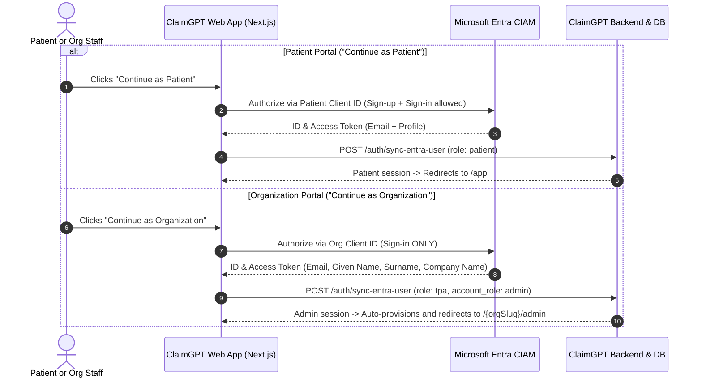

# Microsoft Entra External ID (CIAM) Setup Guide

This guide walks you step-by-step through configuring **Microsoft Entra External ID (CIAM)** with **dual isolated application flows**:
1. **Patient Flow:** Self-service Sign-Up & Sign-In (Email + Password only).
2. **Organization Flow:** Admin/Staff Sign-In only (Self-service Sign-Up disabled via Microsoft Graph API; gathers Given Name, Surname, and Company Name).

---

## 📋 Table of Contents
1. [Authentication Architecture](#1-authentication-architecture)
2. [Environment Variables Overview](#2-environment-variables-overview)
3. [Step 1: Create an External Tenant (CIAM)](#step-1-create-an-external-tenant-ciam)
4. [Step 2: Register Two Single-Page Applications (SPAs)](#step-2-register-two-single-page-applications-spas)
5. [Step 3: Configure Authentication & Redirect URIs](#step-3-configure-authentication--redirect-uris)
6. [Step 4: Create User Flows & Bindings](#step-4-create-user-flows--bindings)
7. [Step 5: Disable Sign-Up on Organization Flow via Microsoft Graph Explorer](#step-5-disable-sign-up-on-organization-flow-via-microsoft-graph-explorer)
8. [Step 6: Collect and Map Credentials to `.env`](#step-6-collect-and-map-credentials-to-env)
9. [Troubleshooting & Verification](#troubleshooting--verification)

---

## 1. Authentication Architecture



---

## 2. Environment Variables Overview

In `claimgpt-designs/.env` (and `.env.example`):

| Variable | Description | Example Value |
| :--- | :--- | :--- |
| `NEXT_PUBLIC_ENABLE_ENTRA_ID` | Master toggle (`true` for Entra ID, `false` for local fallback) | `true` |
| `NEXT_PUBLIC_AUTH_PROVIDER` | Active identity provider | `entra` |
| `NEXT_PUBLIC_ENTRA_PATIENT_CLIENT_ID` | Application (client) ID for **Patient SPA** | `11111111-2222-3333-4444-555555555555` |
| `NEXT_PUBLIC_ORG_ENTRA_CLIENT_ID` | Application (client) ID for **Organization SPA** | `66666666-7777-8888-9999-000000000000` |
| `NEXT_PUBLIC_ENTRA_TENANT_ID` | Directory (tenant) ID of your external tenant | `a1b2c3d4-0000-0000-0000-abcdef123456` |
| `NEXT_PUBLIC_ENTRA_SUBDOMAIN` | Subdomain prefix (`<subdomain>.ciamlogin.com`) | `claimsguru` |
| `NEXT_PUBLIC_ENTRA_AUTHORITY` | Base authority URL | `https://claimsguru.ciamlogin.com/a1b2c3d4-...` |
| `NEXT_PUBLIC_ENTRA_REDIRECT_URI` | Auth callback URL | `http://localhost:3000/auth/callback` |
| `NEXT_PUBLIC_ENTRA_SCOPES` | OpenID Connect scopes | `openid profile email offline_access` |

---

## Step 1: Create an External Tenant (CIAM)

> [!NOTE]
> Microsoft Entra External ID requires a dedicated external tenant configured for customer scenarios.

1. Sign in to the [Microsoft Entra Admin Center](https://entra.microsoft.com/) or [Azure Portal](https://portal.azure.com/).
2. In the left navigation, select **Overview** > **Manage tenants** (or search for *Tenants*).
3. Click **+ Create**.
4. Under **Tenant type**, select **Customer (Microsoft Entra External ID)**.
5. Click **Next: Configuration**:
   - **Tenant name**: e.g., `ClaimsGuru CIAM`
   - **Initial domain name**: Choose a unique subdomain (e.g., `claimsguru`). *This value is your `NEXT_PUBLIC_ENTRA_SUBDOMAIN`.*
   - **Location**: Select your region (e.g., `India`, `United States`, or `Europe`).
6. Click **Review + create** > **Create**.
7. Once created, switch to the new tenant from the top directory switcher.

---

## Step 2: Register Two Single-Page Applications (SPAs)

Inside your new external tenant, register **two separate applications**:

### A. Register Patient Application
1. Navigate to **Applications** > **App registrations**.
2. Click **+ New registration**:
   - **Name**: `ClaimsGuru For Patients`
   - **Supported account types**: **Accounts in this organizational directory only (Customer accounts)**.
   - **Redirect URI**: Platform = **Single-page application (SPA)**, URI = `http://localhost:3000/auth/callback` (and your production domain).
3. Click **Register**. Copy its **Application (client) ID** → `NEXT_PUBLIC_ENTRA_PATIENT_CLIENT_ID`.

### B. Register Organization Application
1. Go back to **Applications** > **App registrations**.
2. Click **+ New registration**:
   - **Name**: `ClaimsGuru For Organizations`
   - **Supported account types**: **Accounts in this organizational directory only (Customer accounts)**.
   - **Redirect URI**: Platform = **Single-page application (SPA)**, URI = `http://localhost:3000/auth/callback` (and your production domain).
3. Click **Register**. Copy its **Application (client) ID** → `NEXT_PUBLIC_ORG_ENTRA_CLIENT_ID`.

---

## Step 3: Configure Authentication & Redirect URIs

Perform this step on **both** app registrations (`ClaimsGuru For Patients` and `ClaimsGuru For Organizations`):

1. In the app registration, click **Authentication** in the left sidebar.
2. Under **Single-page application**:
   - Confirm `http://localhost:3000/auth/callback` is present.
3. Under **Implicit grant and hybrid flows**:
   - Check **ID tokens (used for implicit and hybrid flows)**.
   - Check **Access tokens**.
4. Click **Save**.

### Configure Optional Claims on Organization App:
1. In `ClaimsGuru For Organizations`, go to **Token configuration** in the left menu.
2. Click **+ Add optional claim**.
3. Select **Token type**: **ID** (and **Access**).
4. Check:
   - ☑️ **`company_name`**
   - ☑️ **`given_name`**
   - ☑️ **`family_name`**
5. Click **Add** (and grant Microsoft Graph profile permission if prompted).

---

## Step 4: Create User Flows & Bindings

Navigate to **External Identities** > **User flows**:

### A. Create Patient User Flow (Sign-Up & Sign-In)
1. Click **+ New user flow** > Select **Sign up and sign in**.
2. Name: `Patient_SignUpSignIn`.
3. **Identity providers**: Select **Email with password**.
4. **User attributes**: Keep default (Email Address only).
5. Click **Create**.
6. Open the newly created flow > Click **Applications** under *Customize* > Click **+ Add application** > Select **`ClaimsGuru For Patients`**.

### B. Create Organization User Flow (Sign-In Only)
1. Click **+ New user flow** > Select **Sign up and sign in** (or Sign in).
2. Name: `Org_SignIn`.
3. **Identity providers**: Select **Email with password**.
4. **User attributes**:
   - Check **Given Name** (First Name)
   - Check **Surname** (Last Name)
   - Check **Company Name** (or custom attribute `Organization`)
5. Click **Create**.
6. Open the flow > Click **Applications** > Click **+ Add application** > Select **`ClaimsGuru For Organizations`**.

---

## Step 5: Disable Sign-Up on Organization Flow via Microsoft Graph Explorer

Because organization staff accounts must be created by administrators only, disable public self-service sign-up on the Organization user flow:

### 1. Open Microsoft Graph Explorer
- Go to [Microsoft Graph Explorer](https://developer.microsoft.com/graph/graph-explorer).
- Sign in with your **Tenant Global Administrator** account.

### 2. Grant Permissions
- Click on the **Modify permissions** tab next to the query bar.
- Consent to:
  - `IdentityUserFlow.ReadWrite.All`
  - `Policy.ReadWrite.AuthenticationFlows`

### 3. List User Flows to Find the Flow ID
- **HTTP Method:** `GET`
- **URL:** `https://graph.microsoft.com/beta/identity/authenticationEventsFlows`
- Click **Run query**.
- In the JSON response, locate your organization flow (`Org_SignIn` or `B2X_1_Org_SignIn`) and copy its `"id"` property (e.g. `e4b3c2a1-0000-0000-0000-123456789abc`).

### 4. Send PATCH Request to Disable Sign-Up
- **HTTP Method:** `PATCH`
- **URL:** `https://graph.microsoft.com/beta/identity/authenticationEventsFlows/{USER_FLOW_ID}`
- **Request Headers:**
  ```http
  Content-Type: application/json
  ```
- **Request Body:**
  ```json
  {
    "@odata.type": "#microsoft.graph.externalUsersSelfServiceSignUpEventsFlow",
    "onInteractiveAuthFlowStart": {
      "@odata.type": "#microsoft.graph.onInteractiveAuthFlowStartExternalUsersSelfServiceSignUp",
      "isSignUpAllowed": false
    }
  }
  ```
- Click **Run query**.
- Verify the response returns `204 No Content` or `200 OK`. The *"Don't have an account? Sign up now"* link is now permanently removed from the Organization sign-in screen.

---

## Step 6: Collect and Map Credentials to `.env`

Populate your `claimgpt-designs/.env` (matching `.env.example`):

```env
NEXT_PUBLIC_KEYCLOAK_URL=http://localhost:8080
NEXT_PUBLIC_API_BASE=http://127.0.0.1:8000
INGRESS_API=http://127.0.0.1:8000/ingress
NEXT_PUBLIC_KEYCLOAK_REALM=claimgpt
NEXT_PUBLIC_KEYCLOAK_CLIENT_ID=claimgpt-web
NEXT_PUBLIC_KEYCLOAK_REDIRECT_URI=http://localhost:3000/auth/callback

# Microsoft Entra External ID (CIAM) Configuration
# Set to 'true' to enable Entra ID login, or 'false' for local password login flow
NEXT_PUBLIC_ENABLE_ENTRA_ID=true
NEXT_PUBLIC_AUTH_PROVIDER=entra
NEXT_PUBLIC_ENTRA_PATIENT_CLIENT_ID=your-patient-app-client-guid
NEXT_PUBLIC_ORG_ENTRA_CLIENT_ID=your-org-app-client-guid
NEXT_PUBLIC_ENTRA_TENANT_ID=your-directory-tenant-guid
NEXT_PUBLIC_ENTRA_SUBDOMAIN=your-subdomain-name
NEXT_PUBLIC_ENTRA_AUTHORITY=https://your-subdomain-name.ciamlogin.com/your-directory-tenant-guid
NEXT_PUBLIC_ENTRA_REDIRECT_URI=http://localhost:3000/auth/callback
NEXT_PUBLIC_ENTRA_SCOPES=openid profile email offline_access
```

### Where to Find Each Value in Azure Portal:

| Variable | Azure Portal Location |
| :--- | :--- |
| **`NEXT_PUBLIC_ENTRA_PATIENT_CLIENT_ID`** | **App registrations** > `ClaimsGuru For Patients` > **Overview** > **Application (client) ID** |
| **`NEXT_PUBLIC_ORG_ENTRA_CLIENT_ID`** | **App registrations** > `ClaimsGuru For Organizations` > **Overview** > **Application (client) ID** |
| **`NEXT_PUBLIC_ENTRA_TENANT_ID`** | **App registrations** > (either app) > **Overview** > **Directory (tenant) ID** |
| **`NEXT_PUBLIC_ENTRA_SUBDOMAIN`** | The prefix of your tenant (e.g., `claimsguru` from `claimsguru.onmicrosoft.com` or `claimsguru.ciamlogin.com`) |
| **`NEXT_PUBLIC_ENTRA_AUTHORITY`** | `https://<NEXT_PUBLIC_ENTRA_SUBDOMAIN>.ciamlogin.com/<NEXT_PUBLIC_ENTRA_TENANT_ID>` |
| **`NEXT_PUBLIC_ENTRA_REDIRECT_URI`** | Must match the Redirect URI configured in both apps (`http://localhost:3000/auth/callback`) |
| **`NEXT_PUBLIC_ENTRA_SCOPES`** | `openid profile email offline_access` |

---

## Troubleshooting & Verification

| Issue | Cause | Solution |
| :--- | :--- | :--- |
| **`AADSTS50011: The reply URL... does not match`** | Mismatched redirect URI | Ensure `http://localhost:3000/auth/callback` is added under SPA redirect URIs for **both** app registrations. |
| **`AADSTS54005: Authorization code already redeemed`** | React double-invocation | Handled automatically by the session lock in `app/auth/callback/page.tsx`. Ensure you trigger sign-in from `/login`. |
| **`403 Access Denied: Registered as patient`** | Email was previously registered as patient | Security isolation rule working as intended. Use a staff email or delete previous patient test row. |
| **Missing Company Name in Admin Dashboard** | `company_name` optional claim not enabled | Ensure `company_name` is checked in *Token configuration* for `ClaimsGuru For Organizations`. |
