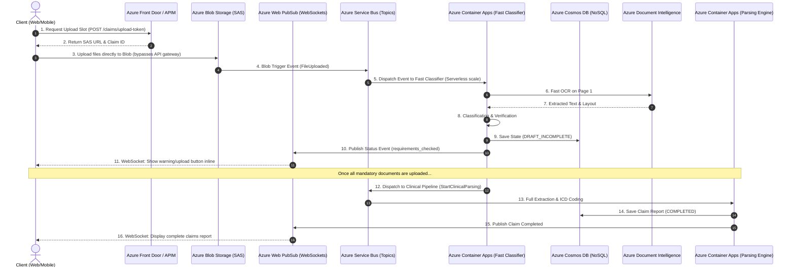

# Azure Enterprise Production Architecture & Cloud Migration Audit

This document audits the current **Docker-Integrated** backend and **Next.js Frontend** setup, identifies scaling vulnerabilities ("bandages"), details the required testing tiers, and outlines the production-ready architecture on **Microsoft Azure** for B2C scaling.

---

## 1. Architectural Vulnerability Audit ("The Bandages")

If the current `docker-compose` setup is deployed directly to the cloud, it will fail under heavy production load. Here is why the current architecture is fragile:

### A. Network & Storage Bottlenecks (Shared Volume Coupling)
* **The Issue**: Services like `ingress`, `ocr_worker`, and `parsing_worker` rely on a shared local docker volume (`shared-storage:/app/services/ingress/storage/raw`) to exchange raw uploaded PDF/Image files.
* **Why it breaks in Azure**: Scaled container instances (e.g., Azure Container Apps) cannot easily share a local writable disk. Using network file shares (like Azure Files NFS) adds severe latency overhead and introduces file locks.
* **Production Fix**: Switch to **Azure Blob Storage**. The frontend should upload files directly to Blob storage using **SAS (Shared Access Signature) tokens** generated by the gateway, offloading all raw byte transfer from application servers.

### B. Single-Threaded Worker Processing (`--pool=solo`)
* **The Issue**: The `ocr_worker` Celery queue runs with `--pool=solo`. This limits it to processing exactly **one** document at a time per worker instance.
* **Why it breaks in Azure**: If 50 users upload files simultaneously, the 50th user will wait minutes for their OCR task to even start.
* **Production Fix**: Configure workers to use `--pool=prefork` with concurrency matched to CPU cores, or run them in serverless container apps using **KEDA (Kubernetes Event-driven Autoscaling)** to scale replicas dynamically based on the queue depth in the message broker.

### C. Message Broker Reliability (Redis Queue)
* **The Issue**: Celery uses Redis as both its broker and result backend.
* **Why it breaks in Azure**: Redis stores queues in-memory. If the Redis node runs out of memory (OOM) or restarts, all queued document jobs, task results, and processing states are permanently lost.
* **Production Fix**: Swap the broker to **Azure Service Bus (Premium)** or **RabbitMQ** to guarantee message durability, dead-letter queues, and automatic retries.

### D. Hardcoded Environment Variables & Secrets
* **The Issue**: Secrets (API keys, Postgres URLs, MinIO credentials) are injected directly via `.env` files or plain text environment variables.
* **Why it breaks in Azure**: Exposes credentials in code repos and deployment logs; rotating keys requires redeploying the entire stack.
* **Production Fix**: Inject secrets dynamically at runtime from **Azure Key Vault** using **Azure Managed Identities** (keyless service-to-service access).

---

## 2. Production Azure Migration Blueprint

To scale to lakhs of concurrent users securely, map local docker services to managed cloud resources:



### Managed Azure Services Mapping

| Docker Component | Azure Production Service | Scaling Mechanism | Benefit |
| :--- | :--- | :--- | :--- |
| **Nginx / Gateway** | **Azure API Management** + **Azure Front Door** | Automatic Global Anycast Routing | DDOS protection, SSL offloading, rate limiting, and global ingress routing. |
| **MinIO / Local disk** | **Azure Blob Storage (RA-GRS)** | Native cloud bandwidth | Direct client uploads bypass gateway overhead completely. |
| **Redis Broker** | **Azure Service Bus (Premium)** | Partitioned partitions | Guaranteed delivery, transaction queues, and dead-letter queues. |
| **Celery Workers** | **Azure Container Apps** | **KEDA Autoscaler** | Container instances scale to 0 when idle and burst to 100+ during peak hours. |
| **PaddleOCR / Local ML** | **Azure AI Document Intelligence** | Managed API throughput | Offloads neural-network parsing to a highly optimized, managed cloud service. |
| **PostgreSQL Container** | **Azure Database for PostgreSQL (Flexible Server)** | Storage Auto-grow + Read Replicas | Automated backups, high availability, and native connection pooling (PgBouncer). |
| **Redis Cache** | **Azure Cache for Redis** | Premium clustered tier | Sub-millisecond transient session caching. |
| **Alert Polling** | **Azure Web PubSub** | Scaled WebSockets connection manager | Pushes validation updates and warning alerts back to user browsers in real time. |

---

## 3. Quality Assurance & Testing Strategy

To guarantee stability, the codebase must implement automated testing across four distinct tiers.

```
┌────────────────────────────────────────────────────────┐
│                   End-to-End Tests                     │
│           (Playwright / Cypress / K6 Load)             │
├────────────────────────────────────────────────────────┤
│                 Integration Tests                      │
│            (Pytest + Testcontainers DB)                │
├────────────────────────────────────────────────────────┤
│                    Unit Tests                          │
│             (Pytest + Mocks / Jest)                    │
└────────────────────────────────────────────────────────┘
```

### A. Backend Testing Tiers

#### 1. Unit Tests (`pytest` + `unittest.mock`)
* **Focus**: Test mathematical models, parsers, and schema validation rules in isolation without starting database or network servers.
* **Mocks**: Mock Gemini/OpenRouter API responses, object storage transfers, and database connections.
* **Example**: Verify that `_check_mandatory_document_coverage` correctly marks a claim as `DOCUMENTS_REQUESTED` if an ID document is missing from the payload.

#### 2. Integration Tests (`pytest` + `testcontainers`)
* **Focus**: Test communication between the FastAPI app, Celery tasks, and the database.
* **Database**: Spin up a temporary postgres database inside a docker container at run time using **Testcontainers**, execute migrations, write records, and verify state persistence.
* **Example**: Upload a sample discharge summary, verify that a `workflow_state` row is created, and assert that the database correctly updates the claim status.

#### 3. End-to-End (E2E) API Tests (`httpx` / `Postman`)
* **Focus**: Test complete ingress-to-output pipeline routes.
* **Example**: Send a `POST /claims` request, poll the processing status until complete, and assert that the `GET /claims/{id}/preview` response contains valid ICD-10 codes and matching patient names.

#### 4. Load & Performance Testing (`k6` or `Locust`)
* **Focus**: Verify gateway throughput, database lock limits, and network latency when under load.
* **Example**: Simulate 1,000 concurrent user uploads to verify that the Postgres connection pooler (PgBouncer) holds and gateway instances load balance correctly.

---

### B. Frontend Testing Tiers

#### 1. Unit & Component Tests (`Jest` + `React Testing Library`)
* **Focus**: Verify component rendering, state hooks, and conditional banners.
* **Example**: Assert that if `isDocumentsRequested` is true, the warning banner containing `"Mandatory Document Missing"` is rendered on screen with the file input element.

#### 2. End-to-End browser Tests (`Playwright`)
* **Focus**: Test authentication flows, real-time WebSocket state changes, and direct document uploads in actual browsers.
* **Example**: Log in with user credentials -> upload file -> verify that progress circular bar animates -> assert that after database completion, the screen renders the full claims audit report dashboard.

---

## 4. Key Considerations for Azure Deployment

1. **Patient B2C Authentication**: 
   * **Do not build local user tables**. Use **Azure AD B2C** or **Auth0/Supabase** to manage user registrations, logins, MFA, and JWT session tokens.
2. **Direct Upload Architecture**:
   * The React UI must request an upload slot -> receive a SAS URL -> upload the document directly to Azure Blob Storage -> notify the Ingress service. The API containers should never touch file bytes directly.
3. **HIPAA & PII Data Protection**:
   * Enable Azure Storage Service Encryption.
   * Implement PII masking (using Azure AI Language) on OCR text before storing it in Cosmos DB.
   * Restrict all inter-container traffic inside an **Azure Virtual Network (VNet)** using Private Endpoints.
